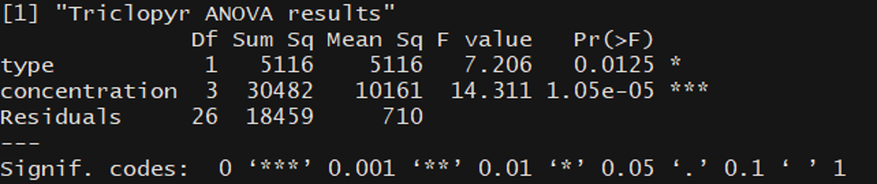
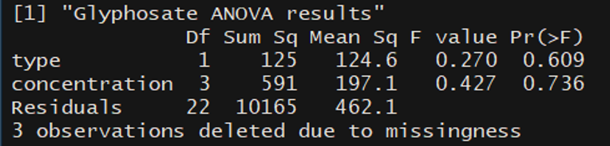
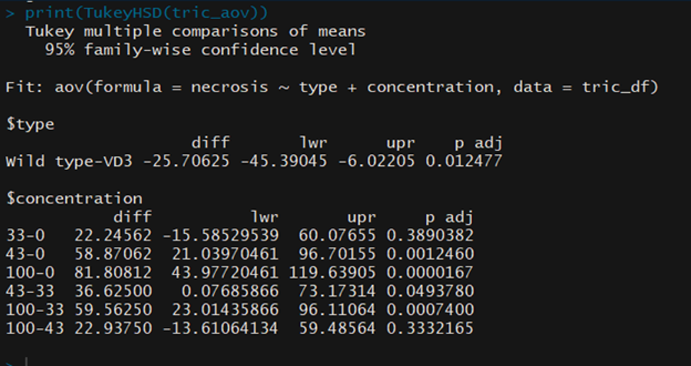
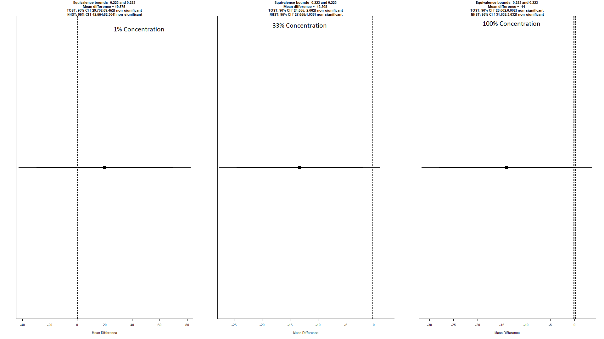

# Strand Glyphosate and Triclopyr Herbicide Analysis
Done for Professor Stuart Strand

### **Packages Needed**
> **"TOSTER"**
Package Info: https://cran.r-project.org/web/packages/TOSTER/TOSTER.pdf         
`install.packages("TOSTER")`

> **"dplyr"**
Package Info: https://cran.r-project.org/web/packages/dplyr/dplyr.pdf        
`install.packages("dplyr")`

## Initial T-tests
A T-test was done for each VD3 and Wild Type at each level provided for both Triclopyr and Glyphosate plants.   

Null hypothesis: No difference between VD3 and Wild Type necrotic level
Alternative hypothesis: Difference between VD3 and Wild Type necrotic level

## Triclopyr results
**Water**   
P-value: -3.182446  3.182446    
 "Fail to reject null hypothesis"   

**33% Diluted Herbicide**   
P-values -3.038819  3.038819    
 "Reject null hypothesis"

**43% Diluted Herbicide**   
P-value: -2.449178  2.449178    
 "Reject null hypothesis"

**Undiluted (100%) Herbicide**   
P-value: -2.812738  2.812738    
 "Reject null hypothesis"   

 ## Glyphosate results

**1% Diluted Herbicide**    
P-Values -3.182443  3.182443    
"Reject null hypothesis"        

**33% Diluted Herbicide**   
P-value: -4.302537  4.302537    
 "Reject null hypothesis"   

**Undiluted (100%) Herbicide**   
P-value: -3.177676  3.177676    
 "Reject null hypothesis"   

## ANOVA results
**Triclopyr**

**Glyphosate**

## Tukey Test for Tricoplyr:
A Tukey test shows which specific groups’ means (compared with each other) are different or significant. This is done because an ANOVA test alone is limited in providing detailed insights between different treatments/groups. R has a built in Tukey function called `TukeyHSD`. The `TukeyHSD` function in R returns the p-values for each level of mean comparison. Here is the table that is returned using that function.

## Equivalence Testing for Glyphosate

Since the resulting ANOVA table for Glyphosates gave results with p-values way above .05, a separate Equivalence test was done on the Glyphosate data. The TOST ``"TOSTER"`` package, and it's function: `TOSTtwo.raw()`, was used to calculate whether or not there was equivalence

**Equivalence Results:**    
The **null hypothesis being if the two plants (VD3 AND Wild Type) are different and the alternate being that they are equivalent** within an acceptable preset limit theta (or bounds) (0% was omitted to due lack of enough values)

**Theta bound:** ln(1.25)

**1% Diluted Herbicide**    
p-value lower bound: 0.230    
p-value upper bound: 0.765    
The equivalence test was *non-significant*, t(6) = 0.770, p = 0.765, given equivalence bounds of -0.223 and 0.223 (on a raw scale) and an alpha of 0.05

**33% Diluted Herbicide**     
p-value lower bound: 0.967    
p-value upper bound: 0.030    
The equivalence test was *non-significant*, t(5) = -2.345, p = 0.967, given equivalence bounds of -0.223 and 0.223 (on a raw scale) and an alpha of 0.05

**Undiluted (100%) Herbicide**    
p-value lower bound: 0.948    
p-value upper bound: 0.048    
The equivalence test was *non-significant*, t(6) = -1.912, p = 0.948, given equivalence bounds of -0.223 and 0.223 (on a raw scale) and an alpha of 0.05

